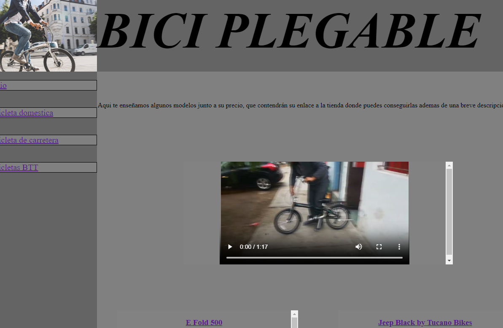
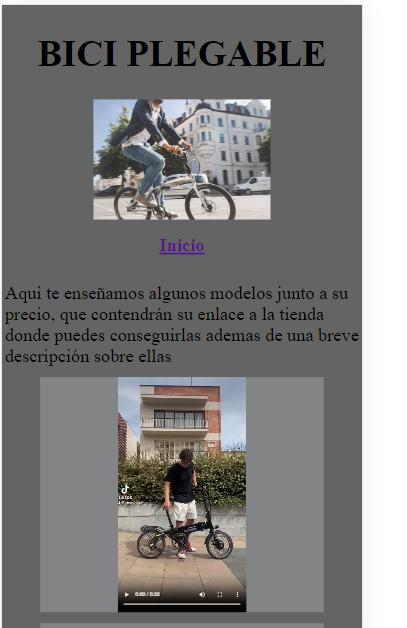

# Estructura de la Página

La estructura general de la página es la siguiente:
- En una misma carpeta, se encuentran todas las páginas y la carpeta "Media", que contiene elementos como videos e imágenes de la página.
- En "Media", se encuentran varias imágenes y carpetas dentro de ella, una carpeta por cada clase de bici, además de una carpeta para los videos.
- Cada carpeta de clase de bici contiene 4 imágenes de bicis.
- En la carpeta de videos, se encuentran los 8 videos usados en la página.

## Herramientas Utilizadas

Para la creación de esta página, me he ayudado de 3 programas:
1. **Microsoft Visual Studio:** para la escritura de código HTML y CSS.
2. **Pixel.net:** un programa de edición de imágenes. Con este programa, eliminé el fondo de las imágenes (no pude hacerlo en todas por falta de tiempo) y las redimensioné para que no ocuparan tanto.
3. **Sony Vegas:** un programa de edición de video con el que pude tanto editar como reducir el tamaño de algunos videos.

## Características de mi Página

- Mi página de bicicletas responsive tiene una estructura de barra lateral y un header superior, con contenido dividido en contenedores en el main.
- La página diseñada para móviles se basa en un simple scroll down para ver todo el contenido, con una imagen en la parte superior.
- Una de las características de esta página es que el contenido respecto a videos varía según lo ves desde un móvil o un ordenador.

